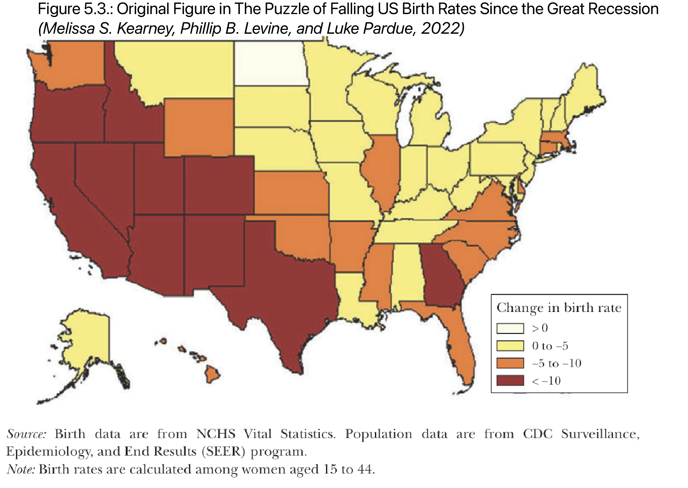

```{r setup, include=FALSE}
knitr::opts_chunk$set(echo = TRUE)

library(tidyverse)
library(knitr)
library(usmap)
library(bookdown)
library(kableExtra)
```

# Introduction
 Birth rates are significant in that they are critical determinants of two socioeconomic factors: population growth and the age structure of the population[@importance-of-brate]. They also provide a measure in reviewing and rearranging the related policies. Therefore, it is important to track the birth rate changes over years and analyze the trend with a variety of factors affecting it.
 
 In the US, there is a remarkable decline in birth rates as of the Great recession in 2007. The Puzzle of Falling US Birth Rates since the Great Recession[@original-paper] decomposes it in diverse aspects including ethnicity, age group of childbearing women, economic and education status of women, etc. Especially in terms of race and ethnicity variables, it shows how the decline aspects differ by each state plotting the birth rate change dataset on the US map. 

 This paper is a replication of the report, but it is differentiated from the original in that it focuses on three specific factors: age group of childbearing women, race and ethnicity. Moreover, it critically analyzes the weakness of the datasets and gives a few insights to improve them. It also demonstrates whether the figures and tables in the report are reproducible with provided datasets in the package.
 
 Specifically, the birth rates in teens and twenties age groups have dramatically shrank while the counterpart of over thirties has increased overall. In terms of race and ethnicity, the birth rates of all the demographic groups including white, black and hispanic have decreased, but this tendency was the most dominant in hispanic group. It describes the reason why there is a discrepancy in birth rates between the states which have a high percentage of hispanic population and those which have not in comparison.
 
 Although there is a limitation that this paper only focuses on specific factors, this replication still has its meaning in that it includes further analyses of the significant factors related to US birth rates decline. Furthermore, it suggests the next steps to improve the original paper especially regarding the comprehensiveness of the datasets and the reproducibility of the paper.

# Data
 The original paper basically uses the birth data as its primary dataset. It is collected and aggregated from the National Center for Health Statistics(NCHS) restricted-use microdata[@NCHS]. The paper also uses Vital Statistics Final Births reports for 2015, 2019[@vital-statistics], and the 2020 Provisional Birth Report[@Provisional] to disaggregate the childbearing women group whose ages are between 15 to 44 and further decompose the groups by age, Hispanic origin, marital status, and state. To disaggregate the childbearing women group by other variables such as mother’s education level, nativity, birth order, and cohort, public birth microdata across 1980-1989 from the NBER Natality Database and NCHS microdata from 1990-2019[@NCHS, @NBER] were manipulated.
 
 Another data the original paper deals with is the population data. In particular, the CDC SEER database[@SEER] was used, and the paper covers the single-age population counts among all races from 1969-2019 and by race, and Hispanic origin from 1990-2019.

 Lastly it also includes other datasets related to various factors. They are long-term changes, female-male median wage ratio, LARC(long-acting reversible contraceptives) usage, student loan debt per capita, average gross rent, child care expenses, and religious importance data.

 This replication paper, however, focuses on the general birth rate trend and three main variables which significantly impacted the trend: age group, race, and ethnicity. Hence, only the birth rate and population data are used in this paper.
 
 The raw and cleaned datasets are both provided in a project package on OPENICPSR[@OPENICPSR]. Since the datasets are all Stata Data File, generally manipulated in STATA environment[@STATA], a general-purpose statistical software package for data manipulation, visualization, and automated reporting, the files cannot be opened in the R environment. However, the project package also includes some of the csv files, a more general format which can be manipulated with R. The list of datasets that this package offers are listed in Table \@ref(tab:t1).

```{r t1, echo=FALSE}
lists_of_datasets <- tibble(`File Name of dataset` = c("fig_1.csv",
                              "fig_2e.csv",
                              "fig_5.csv",
                              "fig_6.csv",
                              "figs_1_2_3.csv",
                              "igs_2a_2b.csv",
                              "numberbirths_2001_2019.csv",
                              "births_educ_race_age6.csv",
                              "numbirths_educ_race_age6.csv",
                              "numbirths_educ_2044.csv",
                              "numbirths_hisp_nativity_mexican.csv"),
       `File Path` =  c("144981-V1/data",
                        "144981-V1/data",
                        "144981-V1/data",
                        "144981-V1/data",
                        "144981-V1/data",
                        "144981-V1/data",
                        "144981-V1/data/annual_policy",
                        "144981-V1/data/decomp",
                        "144981-V1/data/decomp",
                        "144981-V1/data/educ",
                        "144981-V1/data/hisp"))
lists_of_datasets$`File Name of dataset` <- str_replace_all(lists_of_datasets$`File Name of dataset`, ".csv", "")
  

lists_of_datasets |>
  knitr::kable(
    caption = "The List of datasets with File Path",
    col.names = c("File Name of dataset (.csv)", "File Path"),
    booktabs = TRUE,
    linesep = ""
  )|>
  kable_styling(latex_options = "HOLD_position")
```

Among these datasets, this replication paper uses the ‘fig_1.csv’ file for tracking the annual trend in US birth rates from 1980 to 2020. Also, ‘figs_2a_2b.csv’ file is used to see the trends in birth rates by five-year age group, race and ethnicity. Lastly the ‘fig_7.csv’ is manipulated for mapping the change in birth rates by state between two periods 2004-2008 to 2015-2019. 

 Besides the datasets from the project package, this replication paper also includes those from other sources for further analysis. Most of all, World population review dataset[@World-Population-Review] is used to figure out if the states where the hispanic race group accounts for a large portion of the US population is. This dataset was downloaded in csv format from the World Population Review website and was added to the R Project folder. It was further analyzed to demonstrate whether the portion of hispanic population of each state affects the birth rate change between two different periods. With the dataset, it is possible to calculate the total rate of hispanic population of each state, combining all race and ethnicity groups including white hispanic, black hispanic, Asian hispanic, Hawaiian hispanic, Indian hispanic and other hispanic. It was manipulated as a table with the ratio of total hispanic population out of total population by state.

 Moreover, we refered Kerney and Levine's article published in Brookings journal[@KearneyLevine] to show the number of children ever born changes depending on the mother’s birth cohort. Also a dataset from Pew Research Center[@Pew-Research-Center] is used to verify whether the birth rate of the hispanic group is the highest among foreign born as well as among US born as of 2020, which supports that the hispanic race group strongly affects the total US birth rate. Lastly, the datasets from United States Census Bureau[@census] and Iman Ghosh[@Iman] are used to calculate the portion of Asian population by each state. 

# Results

```{r f1, echo=FALSE, show_col_types = FALSE, message = FALSE, fig.cap = "\\label{fig:f1}Trend in US Birth Rates", out.width = "80%"}
# Figure 1. Trend in US Birth Rates
# A. Graph
trend_us_br <- read_csv("fig_1.csv")
trend_us_br |>
  ggplot(aes(x = year, y = brate_all)) +
  geom_line(color = "blue") +
  labs(x = "", y = "Births per 1,000 women age 15-44", 
       caption = "Source: Birth Rates collected from CDC Vital Statistics Births Reports for 2015, 2019, and 2020. \n See Data Appendix for additional detials") +
  scale_x_continuous(breaks = seq(1980, 2020, by = 5), 
                   labels = seq(1980, 2020, by = 5),
                   limits = c(1980, 2020)) +
  scale_y_continuous(breaks = seq(50, 80, by = 5),
                     labels = seq(50, 80, by = 5),
                     limits = c(50, 80)) +
  theme_classic()+
  theme(plot.margin = margin(0,0,0,0),
          line = element_line(colour = "gray"),
        text = element_text(size = 10, face = "plain"),
        title = element_text(size = 10, face = "bold"),
        axis.title.y = element_text(size = 10, face = "plain"),
        panel.grid.major.x = element_blank(),
        panel.grid.major.y = element_line(size = 0.1, color = "gray")) +
  geom_vline(xintercept = 2007, linetype= "dashed", color = "gray", show.legend = 2007) +
  geom_text(aes(x = 2010, y = 70, label = "2007"), 
            size = 5,
            fontface = "plain")
```

```{r t2, echo=FALSE, show_col_types = FALSE, message = FALSE}

# B. Table
peak_bottom_a <- trend_us_br |>
  filter(year %in% c(1990, 1997))

peak_bottom_b <- trend_us_br |>
  filter(year %in% c(2007, 2020))

rate_comparison <- tibble(
  Period = c("1990-1997", "2007-2020"),
  'Decrease Rate (%)' = c((peak_bottom_a[2,2] - peak_bottom_a[1,2])*100/(peak_bottom_a[1,2]),
                      (peak_bottom_b[2,2] - peak_bottom_b[1,2])*100/(peak_bottom_b[1,2]))
)

rate_comparison |>
  knitr::kable(
  caption = "Changes in Births per 1,000 women age 15-44 from 1990-1997 to 2007-2020",
  booktabs = TRUE,
  linesep = "",
  ) |>
  kable_styling(latex_options = "HOLD_position")
```

 As it is projected on Figure \@ref(fig:f1), the birth rate of childbearing women has dropped remarkably as of 2007 albeit it has been fluctuating over time before then. This tendency becomes much clearer when we compare two periods: 1990-1997 and 2007-2020. Apparently there seemed to be a huge decline in the birth rate between 1990-1997 as well. However, the decrease rate of the second period is almost twice lower than that of 1990-1997(Table \@ref(tab:t2)). This result shows the decline in the birth rate from 2007 is an unprecedented phenomenon which should be further analyzed in a variety of aspects to discover attributable factors.


```{r f2, echo=FALSE, show_col_types = FALSE, message = FALSE, fig.cap = "\\label{fig:f2}Trends in Birth Rates for Five-year Age Group", out.width = "80%"}
# Figure2.a. Trends in Birth Rates by Population Subgroup
# A. Five-year age group
trend_us_sg <- read_csv("figs_2a_2b.csv")
trend_us_agegroup <- trend_us_sg |>
  select(1:7)
trend_us_agegroup <- trend_us_agegroup |>
  pivot_longer(cols = 2:7, names_to = "agegroup", values_to = "birth_rate")


text_y_lists <- c(53.0,
                  115.1,
                  112.9,
                  61.9,
                  19.8,
                  3.9)  
text_y_lists <- text_y_lists + 3

trend_us_agegroup_table <- trend_us_agegroup |>
  filter(year %in% c(2007,2020)) |>
  pivot_wider(id_cols = c("agegroup", "birth_rate"),
              names_from = "year",
              values_from = "birth_rate") |>
  summarize(agegroup = str_replace_all(agegroup,"brate_", "Age " ),
            rate = (`2020`-`2007`)*100/`2007`)


trend_us_agegroup |>
  ggplot(aes(x = year, y = birth_rate, color = agegroup)) +
  geom_line() +
  labs(x = "", y = "Births per 1,000 women in \n relevant population subgroup") +
  scale_x_continuous(breaks = seq(1980, 2020, by = 5),
                     labels = seq(1980, 2020, by = 5),
                     limits = c(1980, 2020)) +
  scale_y_continuous(breaks = seq(0, 140, by = 20),
                    labels = seq(0, 140, by = 20),
                    limits = c(0, 140)) +
  theme_classic() +
  theme(plot.margin = margin(0,0,0,0),
        line = element_line(colour = "gray"),
        text = element_text(size = 10, face = "plain"),
        title = element_text(size = 10, face = "bold"),
        axis.title.y = element_text(size = 10, face = "plain"),
        panel.grid.major.x = element_blank(),
        panel.grid.major.y = element_line(size = 0.1, color = "gray"),
        legend.position = "none") +
  geom_vline(xintercept = 2007, linetype= "dashed", color = "gray", show.legend = 2007) +
  geom_text(aes(x = 2010, y = 120, label = "2007"), 
            size = 5,
            fontface = "plain",
            colour = "black") +
  geom_text(aes(x = 1982, y = text_y_lists[1], label = "Age 15-19"),
            size = 4,
            fontface = "plain",
            colour = "black") +
  geom_text(aes(x = 1982, y = text_y_lists[2]-14, label = "Age 20-24"),
            size = 4,
            fontface = "plain",
            colour = "black") +
  geom_text(aes(x = 1982, y = text_y_lists[3], label = "Age 25-29"),
            size = 4,
            fontface = "plain",
            colour = "black") +
  geom_text(aes(x = 1982, y = text_y_lists[4], label = "Age 30-34"),
            size = 4,
            fontface = "plain",
            colour = "black") +
  geom_text(aes(x = 1982, y = text_y_lists[5], label = "Age 35-39"),
            size = 4,
            fontface = "plain",
            colour = "black") +
  geom_text(aes(x = 1982, y = text_y_lists[6], label = "Age 40-44"),
            size = 4,
            fontface = "plain",
            colour = "black")
```

 The first significant factor is related to age groups of childbearing women. While the birth rates of ‘Age 15-19’, ‘Age 20-24’, and ‘Age 25-29’ have drastically decreased since 2007, those of the other older age groups tended to increase overall besides ‘Age 30-34’ subgroup, which slightly increased from 2007 to 2015, but ended up decline from then to 2020.
 
```{r t3, echo=FALSE}
trend_us_agegroup_table |>
  knitr::kable(
    caption = "Changes in Births per 1,000 women age 15-44 from 2007 to 2020 by age group",
    col.names = c("Age Group", "Change Rate (%)"),
    booktabs = TRUE,
    linesep = "")|>
    kable_styling(latex_options = "HOLD_position")
```

 Specifically, the rate changes in proportion to the age. As it is described in Table \@ref(tab:t3), the birth rates have drastically declined in two youngest age groups and especially in ‘Age 15-19’, the birth rate decreased more than 60% around in 10 years. On the other hand, the birth rate in older age groups tended to increase. For instance, the birth rate in the ‘Age 40-44’ age group increased more than 20% in a given period.
 
 This result supports the notion that the maternal age is getting older, which means the childbearing women are delaying their childbearing. However, Kearney and Levine[@KearneyLevine] suggests it is not merely reduced to it. Their research on children ever born by mother’s birth cohort projects how the number of children ever born changes depending on mother’s birth cohort. As the mother's birth cohort is younger, the number of children ever born at the same age is lower. This means more and more women end up having fewer children over generations. Therefore, it is crucial to figure out what makes women delay their childbearing age, and have fewer children. The original paper suggests multiple possible variables such as enhanced women’s socioeconomic status, popularization of long-acting reversible contraceptives (LARC) usage, student loan debt, etc. Besides these quantitative factors, it seems it should also include qualitative research which might help to portray the concrete context of the decision of childbearing women. 

```{r f3, echo=FALSE, show_col_types = FALSE, message = FALSE, warning = FALSE, fig.cap = "Trends in Birth Rates by Race and Ethnicity (Ages 15-44)", out.width = "80%"}
# B. Race and ethnicity (age 15-44)
trend_us_race_ethnicity <- trend_us_sg |>
  select(c(1, 8:10))

trend_us_race_ethnicity <- trend_us_race_ethnicity |>
  filter(is.na(brate_hisp)==FALSE)

trend_us_race_ethnicity <-
  trend_us_race_ethnicity |>
  pivot_longer(cols = 2:4, names_to = "ethnicity_group", values_to = "birth_rate")

text_y_lists_2 <- c(57.5, 72.8, 98.8)
text_y_lists_2 <- text_y_lists_2 +3

trend_us_race_ethnicity |>
  ggplot(aes(x = year, y = birth_rate, colour = ethnicity_group)) +
  geom_line() +
  labs(x = "", y = "Births per 1,000 women in \n relevant population subgroup") +
  scale_x_continuous(breaks = seq(1990, 2020, by = 5),
                    labels = seq(1990, 2020, by = 5),
                    limits = c(1990, 2020)) +
  scale_y_continuous(breaks = seq(0, 140, by = 20),
                    labels = seq(0, 140, by = 20),
                    limits = c(0, 140)) +
  theme_classic() +
  theme(plot.margin = margin(0,0,0,0),
        line = element_line(colour = "gray"),
        text = element_text(size = 8, face = "plain"),
        title = element_text(size = 8, face = "bold"),
        axis.title.y = element_text(size = 8, face = "plain"),
        panel.grid.major.x = element_blank(),
        panel.grid.major.y = element_line(size = 0.1, color = "gray"),
        legend.position = "none")+
  geom_vline(xintercept = 2007, linetype= "dashed", color = "gray", show.legend = 2007) +
  geom_text(aes(x = 2010, y = 137, label = "2007"), 
            size = 5,
            fontface = "plain",
            colour = "black") +
  geom_text(aes(x = 2000, y = text_y_lists_2[1]-7, label = "White, non-Hispanic"),
            size = 4,
            fontface = "plain",
            colour = "black") +
  geom_text(aes(x = 2000, y = text_y_lists_2[2]+2, label = "Black, non-Hispanic"),
            size = 4,
            fontface = "plain",
            colour = "black") +
  geom_text(aes(x = 2000, y = text_y_lists_2[3]+2, label = "Hispanic"),
            size = 4,
            fontface = "plain",
            colour = "black") 
```

 Another variable affecting the US birth rate is race and ethnicity. Figure \@ref(fig:f3) displays how the birth rate differs depending on three different race groups: hispanic, black non-hispanic, and white non-hispanic. As of 2007, the birth rate started to decrease gradually in all race groups, and this tendency was particularly dominant in the hispanic group. In 2007, the birth rate of the hispanic group was 97.4. In 2020, it ended up plummeting to 62.8. Considering the birth rate of the hispanic group is the highest among foreign born as well as among US born as of 2020[@Pew-Research-Center], it is possible to say that the hispanic group strongly affects the total US birth rate as well.
 
 To prove the decline in US birth rate is not merely due to the decrease of the number of hispanic women, the absolute population of the hispanic childbearing women should be reviewed. According to the calculations from the American Community Survey, the share of Hispanic women of childbearing age who are native born has increased from 49.3 percent in 2007 to 61.7 percent in 2018. Therefore, it is hard to say that the decline is mainly attributed to the decrease of hispanic women population. It is more convincing to say that hispanic women started to have fewer children from 2007.

```{r f4, echo=FALSE, show_col_types = FALSE, message = FALSE, fig.cap = "Change in Birth Rates by State, 2004-2008 to 2015-2019", out.width="80%"}
# Change in Birth Rates by State, 2004-2008 to 2015-2019
change_br_by_state <- read_csv("numbirths_2001_2019.csv")
change_br_by_state <- change_br_by_state |>
  filter(year %in% c(2004:2008, 2015:2019))
change_br_by_state <- change_br_by_state |>
  mutate(period = case_when(
    year>=2004 & year <=2008 ~ "2004-2008",
    year >2009 ~ "2015-2019"))
change_br_by_state_cleaned <- change_br_by_state |>
  group_by(stname, period) |>
  summarize(averge= mean(numbirth1544))
view(change_br_by_state)
view(change_br_by_state_cleaned)
change_br_by_state_period_1 <- change_br_by_state_cleaned |>
  filter(period == "2004-2008")
change_br_by_state_period_2 <- change_br_by_state_cleaned |>
  filter(period == "2015-2019")

change_br_by_state_updated <- change_br_by_state_period_1 |>
  cbind(change_br_by_state_period_2$period, change_br_by_state_period_2$averge)
colnames(change_br_by_state_updated) <- c("state", "period_1", "average_1", "period_2", "average_2")

change_br_by_state_final <- change_br_by_state_updated |>
  mutate(rate = (average_2 - average_1)/average_1 *100) |>
  select(state, rate) |>
  mutate(rate_category = case_when(
    rate > 0 ~ "> 0",
    rate > -5 & rate <=0 ~ "0 to -5",
    rate > -10 & rate <=-5 ~ "-5 to -10",
    rate <= -10 ~ "< -10"
  ))

change_br_state_data <- read_csv("fig_7.csv")
colnames(change_br_state_data) <- c("state", "rate")
change_br_state_data <- change_br_state_data |>
  mutate(rate_category = case_when(
    rate > 0 ~ "> 0",
    rate > -5 & rate <=0 ~ "0 to -5",
    rate > -10 & rate <=-5 ~ "-5 to -10",
    rate <= -10 ~ "< -10"
  ))

plot_usmap(data = change_br_state_data, values = "rate_category", regions = "states") +
  labs(caption = "Source: Birth data are from NCHS Vital Statistics. \n Population data are from CDC sruveillance, Epidemiology, and End Results (SEER) program. \n Note: Birth rates are calculated among women aged 15 to 44") +
  theme(panel.background=element_blank(),
        title = element_text(face = "bold"),
        text = element_text(face = "plain"),
        legend.position = "right") +
  scale_fill_manual(values = c("> 0" = "white", 
                               "0 to -5" = "yellow",
                               "-5 to -10" = "orange",
                               "< -10" = "red"),
                    name = "Change in Birth Rate")
```

```{r t4, echo=FALSE, message = FALSE, warning=FALSE}
# Hispanic data
hispanic_data <- read_csv("hispanic.csv")
hispanic_data <- hispanic_data |>
  mutate(hispanic_total_rate = (WhiteHispanicPerc + BlackHispanicPerc + AsianHispanicPerc + HawaiianHispanicPerc + IndianHispanicPerc + OtherHispanicPerc)*100)
hispanic_data <- hispanic_data |>
  select(State, hispanic_total_rate) |>
  arrange(desc(hispanic_total_rate))

hispanic_data <- head(hispanic_data, n = 5)

hispanic_data |>
  knitr::kable(col.names = c("State Name", "Hispanic Percentage (%)"),
               caption = "The percentage of hispanic population by each state",
               booktabs = TRUE,
               linesep = "")|>
    kable_styling(latex_options = "HOLD_position")

```

 This tendency can be plotted in a geological dimension as well. Figure 4\@ref(fig:f4) portrays the change in birth rates by state between two periods 2004-2008 to 2015-2019. The changes in birth rate in Southwest states were more dramatic compared to the others, reaching down to -10% difference. According to World population review[@World-Population-Review], Puerto Rico, New Mexico, Texas, California, and Arizona are the top 5 states(Table \@ref(tab:t4))where the Hispanic demographic accounts for a sizable portion of the population, which are colored red. This consistency makes it possible to conclude the birth rate decline in the hispanic group impacted on the changes by each state.
 
# Discussion

## Comprehensiveness of the race and ethnicity birth rate dataset
 One of the fatal weaknesses of the original paper is that they are using the dataset of US birth rate by race and ethnicity which basically doesn’t include Asian population. It only consists of white, black, and hispanic.
 
 However, according to the population census completed on April 1, 2020 by the United States Census Bureau[@census], Asian population reaches 5.9% of the whole US total population, which is not neglectable. In particular, Asians account for 15% of California population, and 9% of Washington D.C as of 2020[@Iman]. Furthermore, it is forecasted to account for 8.9% of the US total population in 2060. Therefore, encompassing more various demographic groups including Asian will be the next step for enhancing comprehensiveness in terms of race and ethnicity.

## Weakness of reproducibility

 The other weakness of this paper is in reproductivility. To replicate the Figure \@ref(fig:f4), we manipulated two provided csv datasets: ‘numbirths_2001_2009.csv’ and ‘fig_7.csv’(Table \@ref(tab:t1)). The first one consists of three columns: year, state name, and the number of births among 15 to 44 women. We filtered the only years that we need to replicate the figure: 2004-2008, 2015-2019. Then, we calculated the average number of births of each period and made a new dataset of the changes between two periods. The problem occurred when we plotted the dataset on map; some states were mis-colored. Hence, we decided to use another dataset file ‘fig_7.csv’, instead of ‘numbirths_2001_2009.csv’. The dataset provides the calculated change rates between two periods. However, the dataset plot was still mis-colored albeit the discrepancy was reduced compared to the previous dataset.
 
```{r f5, echo= FALSE, show_col_types = FALSE, message = FALSE, out.width = "60%"}

plot_usmap(data = change_br_by_state_final, values = "rate_category", regions = "states") +
  labs(title = "Figure 5.1. Generated with 'numbirths_2001_2009.csv'",
       subtitle = "Change in Birth Rates by State, 2004-2008, 2015-2019",
       caption = "Source: Birth data are from NCHS Vital Statistics. \n Population data are from CDC sruveillance, Epidemiology, and End Results (SEER) program. \n Note: Birth rates are calculated among women aged 15 to 44") +
  theme(panel.background=element_blank(),
        title = element_text(face = "bold", size = 10),
        text = element_text(face = "plain", size = 8),
        legend.position = "right") +
  scale_fill_manual(values = c("> 0" = "white", 
                               "0 to -5" = "yellow",
                               "-5 to -10" = "orange",
                               "< -10" = "red"),
                    name = "Change in birth rate")
```


```{r f6, echo= FALSE, show_col_types = FALSE, message = FALSE, out.width = "60%"}
plot_usmap(data = change_br_state_data, values = "rate_category", regions = "states") +
  labs(title = "Figure 5.2.: Generated with 'fig_6.csv'",
  subtitle = "Change in Birth Rates by State, 2004-2008 to 2015-2019",
       caption = "Source: Birth data are from NCHS Vital Statistics. \n Population data are from CDC sruveillance, Epidemiology, and End Results (SEER) program. \n Note: Birth rates are calculated among women aged 15 to 44") +
  theme(panel.background=element_blank(),
        title = element_text(face = "bold", size = 10),
        text = element_text(face = "plain", size = 8),
        legend.position = "right") +
  scale_fill_manual(values = c("> 0" = "white", 
                               "0 to -5" = "yellow",
                               "-5 to -10" = "orange",
                               "< -10" = "red"),
                    name = "Change in birth rate") 
```

```{r f5_3, echo= FALSE, show_col_types = FALSE, message = FALSE, out.width = "60%"}

```
 
 In conclusion, it was impossible to successfully reproduce the same figure as in the original paper. The birth rate changes calculated with the raw data ‘numbirths_2001_2009.csv’ were not consistent with the provided dataset ‘fig_7.csv, and moreover the ‘fig_7.csv’ turned out impossible to be plotted in the same way with that in the original paper. Inconsistency between two datasets, and the discrepancy between the datasets with the figure are fatal in terms of reproducibility of a paper.


## Conclusion
 This paper analyzed why the US birth rates have dramatically shrank since the Great Recession in 2007, focusing on three variables: age group of childbearing women, race, and ethnicity. All the datasets and their sources used in this paper were listed mainly birth rate data, and population data. The replications of tables and figures were suggested as well, with their weaknesses and next steps for further study.

 In this replication paper, we demonstrated the US birth rate has drastically decreased since 2007, and especially the decline was remarkable in younger childbearing women age group among teens and twenties. It means more and more women end up having fewer children as well as childbearing women are delaying their childbearing over generation. The decline of US birth rate can be also decomposed in race and ethnicity dimension. The decrease rate was the highest in hispanic race group, and the US states where hispanic population accounts for a sizable portion of the whole showed more prominent decrease rate, particularly compared to the counterparts.

 It is meaningful that this paper scrutinizes a variety of factors affecting the decline in US birth rate, and suggest next steps for further study. To further improve the limitation of the original paper in terms of comprehensiveness and reproducibility, it is critical to include more various demographic groups into datasets, and to provide more consistent datasets which can be reproduced in every working environment. 

# References
